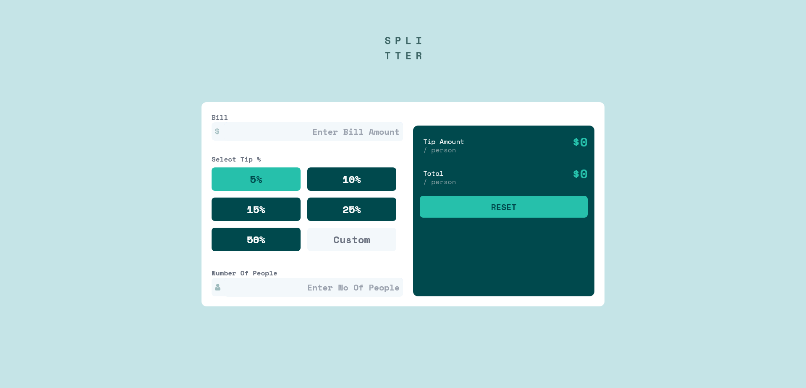
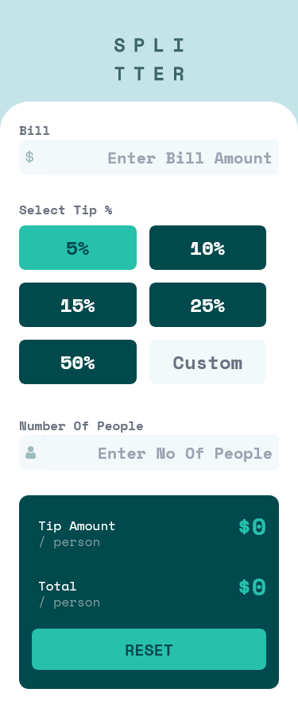

# Frontend Mentor - Tip calculator app solution

This is a solution to the [Tip calculator app challenge on Frontend Mentor](https://www.frontendmentor.io/challenges/tip-calculator-app-ugJNGbJUX). Frontend Mentor challenges help you improve your coding skills by building realistic projects.

## Table of contents

- [Overview](#overview)
  - [The challenge](#the-challenge)
  - [Screenshot](#screenshot)
  - [Links](#links)
- [My process](#my-process)
  - [Built with](#built-with)
- [Author](#author)

## Overview

### The challenge

Users should be able to:

- View the optimal layout for the app depending on their device's screen size
- See hover states for all interactive elements on the page
- Calculate the correct tip and total cost of the bill per person

### Screenshot

### Links

- Solution URL: [Add solution URL here](https://www.frontendmentor.io/solutions/tip-calculator-app-using-next-js-tailwind-css-Rsu6bZ5Z7)
- Live Site URL: [Add live site URL here](https://tip-calculator-next-tailwindcss-scss.vercel.app/)

### Built with

- Semantic HTML5 markup
- Tailwind Css
- Flexbox
- CSS Grid
- Mobile-first workflow
- [React](https://reactjs.org/) - JS library
- [Next.js](https://nextjs.org/) - React framework

## Author

- Website - [Ranjeet (HR Developers)](https://modest-jones-78fd0c.netlify.app/)
- Frontend Mentor - [@its-me-rcode](https://www.frontendmentor.io/profile/yourusername)
- Twitter - [@@its_me_ranjeeth](https://www.twitter.com/@its_me_ranjeeth)
